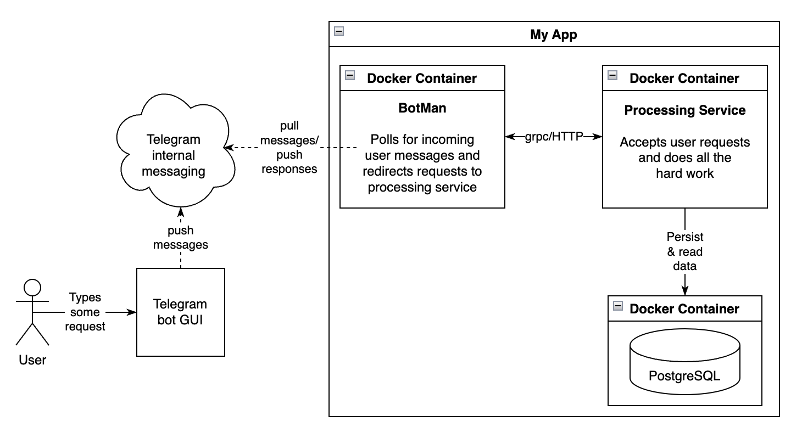

# Word learning bot

## Idea
Идея проекта – разработать телеграм бота, с помощью которого можно учить незнакомые термины на 
английском, которые пользователь решил добавить сам.

Терминология в контексте проекта:
```
термин    – слово или которкая фраза
коллекция - набор терминов конкретного пользователя
задача    - термин из коллекции, который нужно правильно перевести
```

Схема проста. Пользователь увидел незнакомый термин (например в онлайн игре), отправил в 
телеграм бота, добавил перевод, потом получает случайные задачи на повторение 
по заданному таймеру или по запросу.

## Possible improvements
1. Код телеграм бота сделан на скорую руку, желательно переписать
1. Можно переделать get запрос коллекции на grpc stream (пока оставил unary, чтобы успеть)
1. Добавить нормальную авторизацию и регистрацию (не через basic authentication)
1. Вернуть хэширование через bcrypt (сейчас sha512), для basic auth 1+ секунда на 
проверку хэша через bcrypt слишком критично, нужны сессии/токены/что-то ещё
1. Распарсить grpc статусы из ошибок на клиенте (боте) и выводить более понятную информацию

## Questions
1. Как лучше прокидывать user id в эндпоинты, чтобы везде не чекать метадату с ошибками

-----

## Implementation Concept

### Functional Requirements

**План максимум**

Требования приоритезированы по технике [MoSCoW](https://www.productplan.com/uploads/MoSCoW-01.png)

1. [M] Хочу добавлять термины на английском языке для последующего изучения
1. [M] Хочу добавлять перевод вручную
1. [M] Хочу получать список моих сохраненных терминов
1. [M] Хочу получать задачу по запросу к системе
1. [M] Хочу чтобы мой вариант перевода автоматически сверялся с сохраненным значением
1. [S] Хочу получать задачу по подписке (например, раз в час)
1. [S] Хочу удалять ненужные термины из коллекции
1. [S] Хочу иметь определения термина на иностранном языке из стороннего API
1. [C] Хочу чтобы термины автоматически переводились на мой родной язык
1. [С] Хочу узнавать, если перевод не был найден и добавлять его вручную
1. [C] Хочу подтверждать, что перевод соответствует ожидаемому
1. [W] Хочу помечать термины изученными
1. [W] Хочу чтобы неизученные термины появлялись в заданиях чаще
1. [W] Хочу хранить статистику по правильности переводов слов, чтобы определять 
на каких словах ошибаюсь чаще всего
1. [W] Хочу обновлять информацию по существующим терминам

**MVP**

Обязательная функциональность:
- [x] Хочу сохранять термины на английском языке для последующего изучения
- [x] Хочу добавлять перевод терминов вручную
- [x] Хочу получать список моих сохраненных терминов (коллекцию)
- [x] Хочу получать задачу по запросу к системе
- [x] Хочу чтобы мой вариант перевода сверялся с сохраненным значением

Если успею:
- [ ] Хочу получать задачу по подписке (например, раз в час)
- [ ] Хочу удалять ненужные термины из коллекции
- [ ] Хочу иметь определения термина на английском языке из стороннего API


### Default Constraints

1. Сервис должен предоставлять gRPC интерфейс
1. Сервис должен предоставлять HTTP интерфейс как прокси к gRPC интерфейсу
1. Интерфейс бота, используемый в мессенджере, должен быть продублирован через gRPC/HTTP ручки
1. Код должен быть покрыт тестами, с использованием моков
1. Сервис должен использовать миграции при работе с БД
1. База данных должна быть PostgreSQL
1. Взаимодействие с сервисом через интерфейс Telegram бота
1. Сервис должен хранить конфигурацию в yaml файлах
1. Сервис должен быть завёрнут в докер
1. Дедлайн – 16 мая 2022

### Business Constaints

1. Ограничение количества терминов на пользователя – 20
1. Иностранный язык - английский, родной язык - русский
1. MVP должно работать без вложения средств на сервер/API/итп


## Conceptual Diagram

